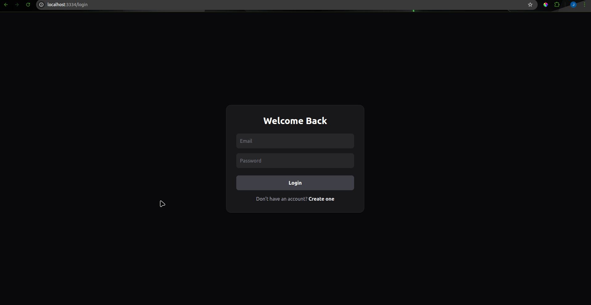

# Flowboard

Flowboard is a **Trello-inspired project management application** built with **Laravel (backend)** and **Angular (frontend)**.

It supports:

- Multiple users
- Multiple workspaces per user
- Boards with lists and tasks
- Drag & drop for lists and tasks (Kanban-style)
- Docker-based local development

---

## Screenshots

### Workspaces and Login



### Board – Lists & Tasks (Drag & Drop)


## Tech Stack

- Backend: Laravel (PHP)
- Frontend: Angular
- Database: MySQL
- Authentication: JWT
- Infrastructure: Docker & Docker Compose

---

## Project Structure

```
.
├── backend/
│   └── flowboard/
│       ├── .env.example                 # Laravel environment example
│       └── ...                          # Laravel source files
├── frontend/
│   └── flowboard/
│       ├── public/
│       │   └── config/
│       │       └── config.example.json  # Frontend runtime config example
│       └── ...                          # Angular source files
├── docker-compose.yml
├── .env.example                         # Docker environment example

```

---

## Requirements

- Docker
- Docker Compose

No local PHP, Node, or MySQL installation is required.

---

## Environment Configuration

### 1. Root .env

Create a `.env` file in the root folder (same level as `docker-compose.yml`).

Required variables:

```
APP_PORT=4200
MYSQL_PORT=3306
BACKEND_PORT=8000
```

---

### 2. Backend environment (Laravel)

Inside `backend/flowboard`:

```
cp .env.example .env
```

Important variables:

```
APP_ENV=local
APP_DEBUG=true
APP_URL=http://localhost

DB_CONNECTION=mysql
DB_HOST=dev-mysql
DB_PORT=3306
DB_DATABASE=flowboard
DB_USERNAME=root
DB_PASSWORD=root

JWT_SECRET=
```

---

### 3. Frontend configuration

Create the runtime config file:

Path:

```
frontend/flowboard/public/config
```

Create `config.json`:

```
{
  "apiBaseUrl": "http://localhost:8000"
}
```

---

## Build & Run

From the root folder:

```
docker compose up --build
```

Generate keys:

```
docker exec -it dev-laravel php artisan key:generate
docker exec -it dev-laravel php artisan jwt:secret
```

Run Migrations:

```
docker exec -it dev-laravel php artisan migrate
```

---

## Access

- Frontend: http://localhost:4200
- Backend API: http://localhost:8000

---

---

## Notes

- Inspired by Trello
- Built for learning and portfolio purposes
- Server-side ordering ensures drag & drop consistency

---
